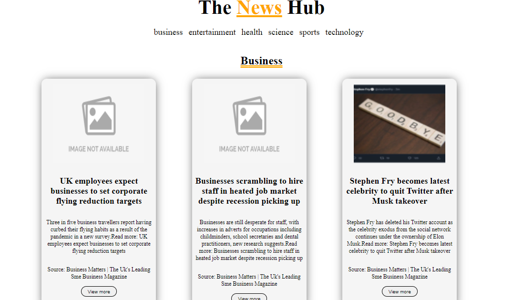

# The News Hub - NextJS

## :link:	Live Demo 
[Demo Link](https://news-nextjs-two.vercel.app/)

## 📷 Screenshot

  

## 📝 Project Description

The News App project allows users to view the list of news in real time. The application served as the first NextJS developed. 

## 📚 Technologies

- ReactJS
- NextJS
- CSS
## :compass: Roadmap

- [x] Fetch news from the API according to the selected category 

## :star:	Acknowledgements
 - [mediastack](https://mediastack.com/)
 - [Axios](https://www.npmjs.com/package/axios)
